## 🧾User Profile Management System
This is simple User Profile Management System with  backend framework built with Node.js and Express.js. It is designed to facilitate the development of RESTful APIs and microservices by providing a structured architecture and reusable components.

## 🚀TechStack:-

1. **Node.js** — JavaScript runtime environment

2. **Express.js** — Web framework for Node.js

3. **Cors** — Middleware for enabling Cross-Origin Resource Sharing

4. **Cookie-parser** — Middleware to parse cookies

5. **dotenv** — Loads environment variables from .env files

6. **nodemon** — Tool for automatically restarting the server during development

7. **mongoose** — MongoDB object modeling for Node.js

8. **jsonwebtoken** — JSON Web Token implementation for authentication

9. **bcrypt** — Library to hash passwords securely

## 🛠️SetUp:-

Follow these steps to set up the SuperGram-riya backend on your local machine:

1. Clone the repository
   ```bash
     git clone https://github.com/ri123-ya/SuperGram-riya.git
   ```
3. Navigate to the project directory
   ```bash
     cd api
   ```
5. Install dependencies
     Make sure you have Node.js installed. Then run:
   ```bash
     npm install
   ```
     to install all the Packages
     

7. Configure environment variables
     Create a .env file in the root folder (same level as index.js) and add necessary variables. For example:
    ```bash
     PORT=3000
      MONGODB_URI=your_mongodb_connection_string
      JWT_SECRET=your_secret_key_for_tokens
    ```
      Replace your_mongodb_connection_string with your actual MongoDB connection URI. If you don’t have MongoDB locally, you can use a service like MongoDB Atlas.

8. Start the server
    To run the server in development mode (with automatic restarts on file changes):
   ```bash
     npm install nodemon
   ```
     in package.json add
   ```bash
     "scripts": {
        "dev": "nodemon index.js"
     }
   ```
    Then run-
   ```bash
    npm run dev
   ```

9. Test the API
   Once the server is running, you can test the API endpoints  using Postman  by sending requests as
   ```bash
   http://localhost:3000/
   ```

## 📂File Structure
```bash
  API/
├── controllers/            # Controller logic for handling requests
│   └── auth.controller.js  # Authentication controller
├── lib/                    # Utility and DB connection files
│   ├── db.js               # MongoDB connection setup
│   └── utils.js            # generating jwt token
├── middlewares/            # Middleware functions
│   └── protected.js        # Middleware for route protection (for user and admin)
├── models/                 # Mongoose schema definitions
│   └── user.schema.js      # User schema (usr/admin)
├── routes/                 # API routes
│   └── auth.route.js       # Authentication routes
├── .env                    # Environment variables 
├── .gitignore              # Git ignore rules
├── index.js                # Main server entry point
├── package-lock.json       # NPM package lock file
├── package.json            # Project dependencies and scripts
└── README.md               # Project documentation
```

## 📬API Endpoints (With Postman Screenshots)

**🔐Auth Routes**
**✅ POST /register**
**User Registration:**

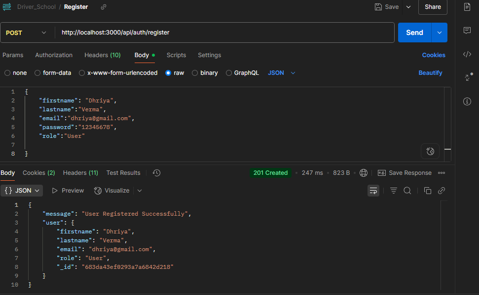

Admin Registration:

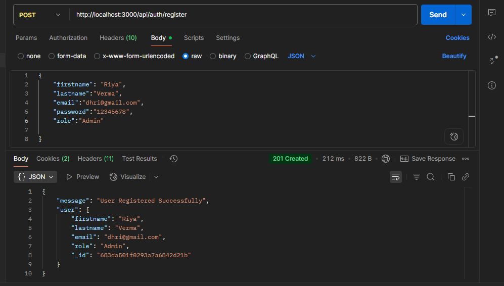


**🔓 POST /login**
User Login:
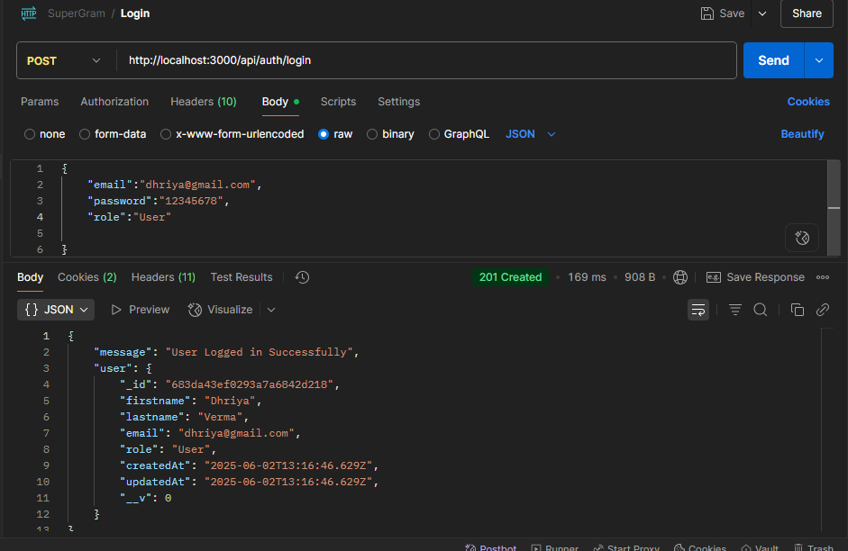

Admin Login:
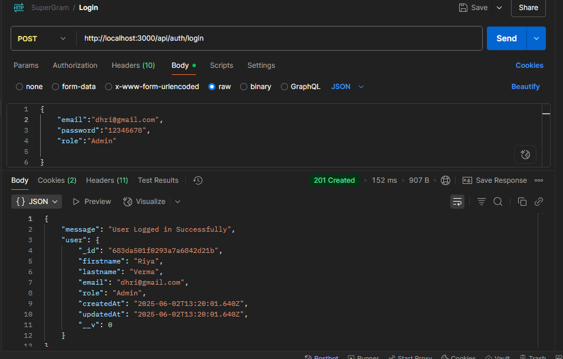

**🔒 POST /logout**
User Logout:
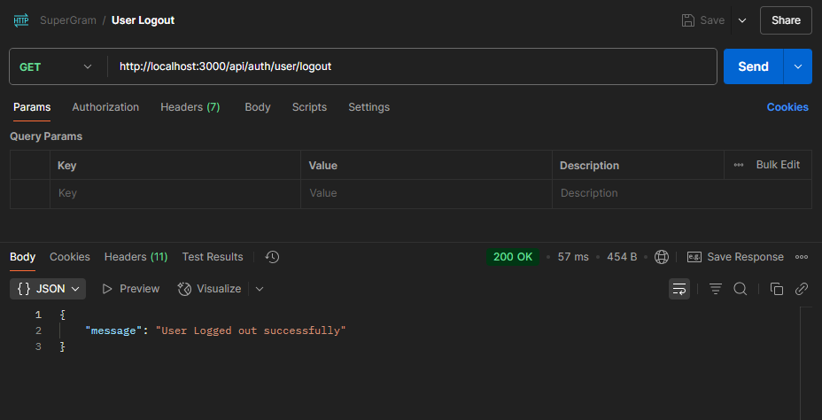

Admin Logout:
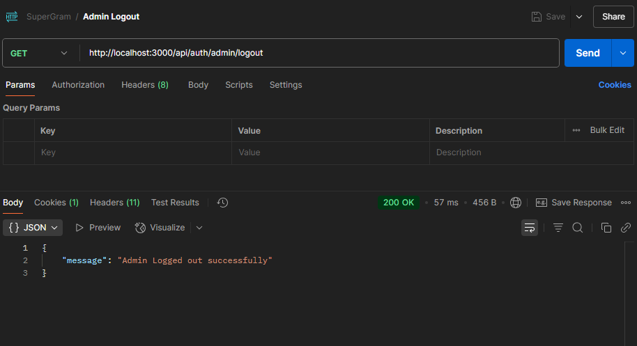

**👤 Profile Routes**
**📄 GET /profile**
User Profile:
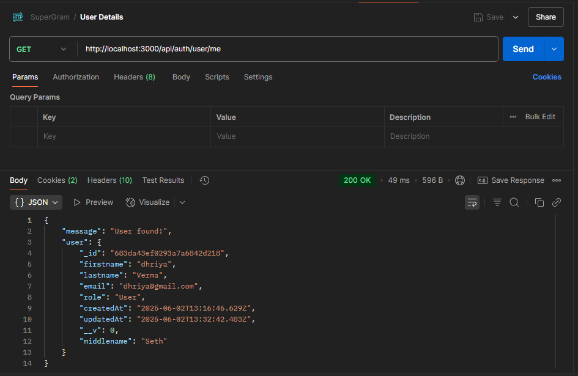

Admin Profile:
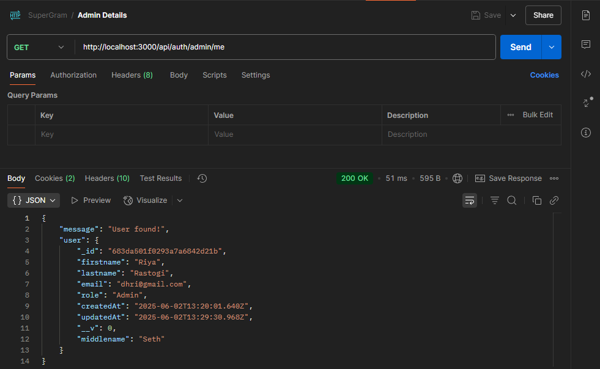

**📝 Profile Update**
**✏️ PUT /update**
User Profile Update:
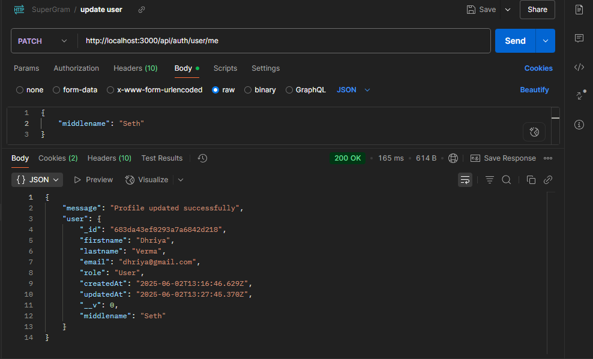

Admin Updating Own Profile:
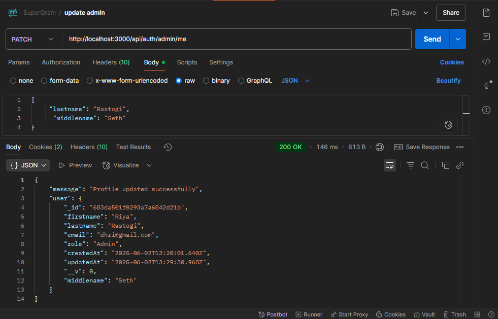

Admin Updating Another User:
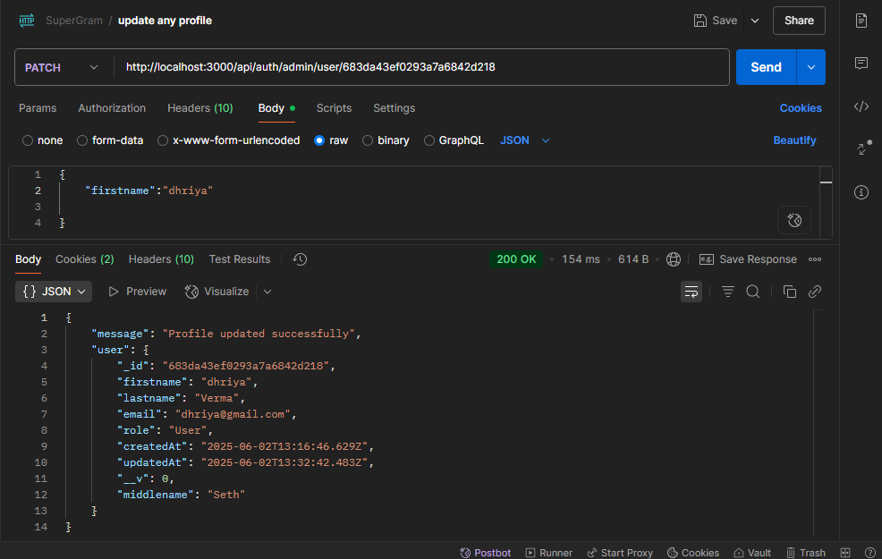

**📋 Admin: View All Users**
**📑 GET /users**
Admin View All Users:
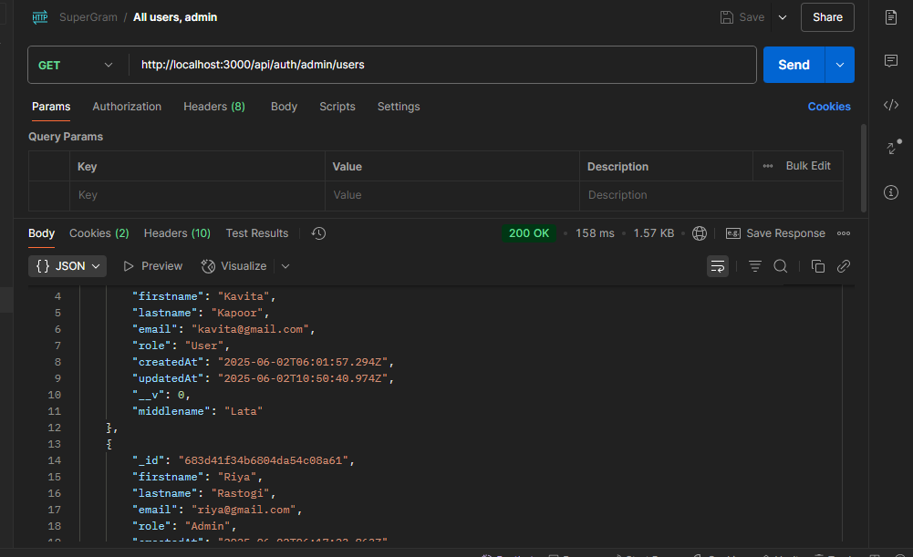

**🍪 Cookies (Token / Session)**
Admin Auth Cookies:
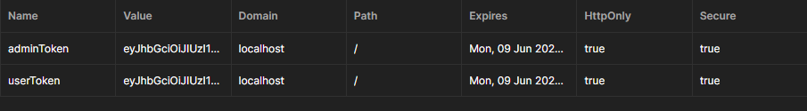
